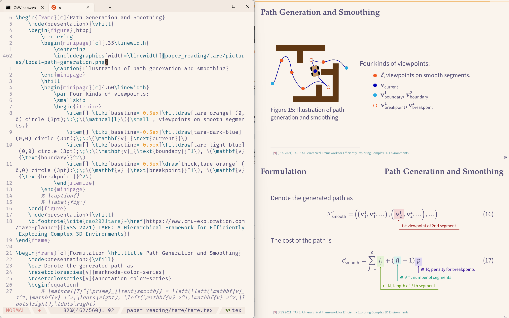

# LaTeX in Docker

My dockerized LaTeX IDE:



Main utilities:

| Utilities     | Description |
|------|-------------|
| [TeX Live](https://tug.org/texlive/) | Comprehensive TeX Distribution |
| [Zathura](https://pwmt.org/projects/zathura/) | PDF Viewer for Minimalists |
| [pdfpc](https://github.com/pdfpc/pdfpc) | GTK-based presentation application |
| [Neovim](https://neovim.io/) | Text Editor |
| [VimTex](https://neovim.io/) | Vim Plugin for LaTeX |

## Install

> [!NOTE]
> Docker and Docker Compose must be installed. Basic knowledge of Docker is required.

### Acquire Docker image
```sh
docker pull xiaosq2000/latex:latest
docker tag xiaosq2000/latex:latest latex:latest
```

### Generate configuration files
```sh
git clone git@github.com:xiaosq2000/latex-docker.git 
cd latex-docker
python3 -m venv venv 
source venv/bin/activate
python3 -m pip install -r requirements.txt
python3 generate_templates.py --service-name latex --env-file .env --nvidia --x11 --dbus --entrypoint
```

## Usage
```sh
docker compose up -d 
docker exec -it latex zsh -i
```

## Todo

1. Use jinja2 as template engine.
2. Support audio. Reference: [How to set up sound w/o x11docker](https://github.com/mviereck/x11docker/wiki/Container-sound:-ALSA-or-Pulseaudio).
